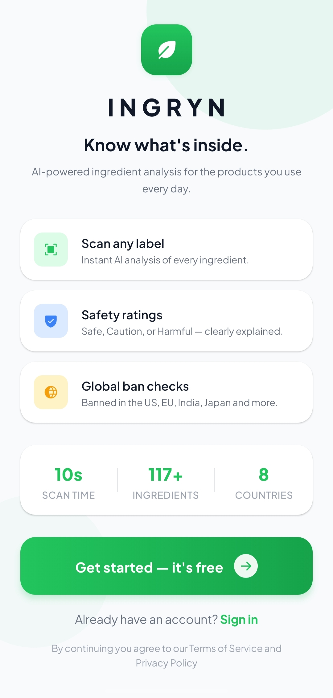
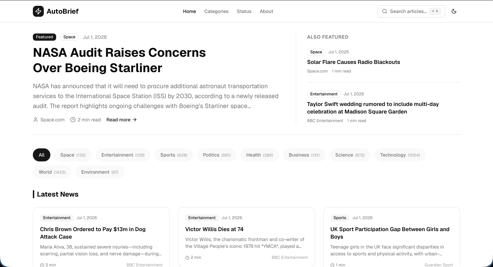
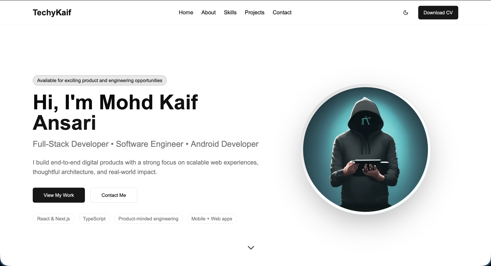

  

 

  

<h1 align="center">Mohd Kaif Ansari</h1>

AI Engineer • Full Stack Developer

Building software powered by artificial intelligence, automation, and thoughtful engineering.

---

## About

I'm a software engineer focused on building products that solve practical problems through modern web technologies and artificial intelligence.

Over the past few years I've worked on mobile applications, AI-powered automation platforms, full-stack web applications, and developer tooling.

I enjoy designing systems that are simple, maintainable, and scalable.

---

## Featured Work

### IngRyn

An AI-powered ingredient scanner that combines OCR and large language models to help users better understand packaged food ingredients.

**Highlights**

- React Native application
- OCR integration
- AI ingredient analysis
- Authentication with Supabase
- Mobile-first design

Repository

https://github.com/techykaif/ingryn

---

### AutoBrief AI

An automated publishing platform that collects news, processes content with AI, and generates SEO-ready articles.

**Highlights**

- Automated RSS pipeline
- AI-generated articles
- Search
- Categories
- Modern Next.js architecture

Live

https://autobrief-ai.vercel.app

---

### Portfolio

A modern portfolio designed around simplicity, performance, and accessibility.

Live

https://techykaif.vercel.app

---

## Technology

| Area | Technologies |
|------|--------------|
| Languages | Python, TypeScript, JavaScript, Java, SQL |
| Frontend | React, Next.js, React Native, Tailwind CSS |
| Backend | Node.js, Express, Supabase, Firebase |
| AI | Gemini API, OpenAI API, OCR, Prompt Engineering |
| Infrastructure | AWS, Docker, Git, GitHub Actions, Linux |

---

## GitHub

---

## Currently Working On

- IngRyn
- AutoBrief AI
- Personal Portfolio
- AI-powered developer tools

---

## Connect

Portfolio

https://techykaif.vercel.app

LinkedIn

https://linkedin.com/in/mohd-kaif-ansari-0754522bb

Email

mka10171@gmail.com

---

> Building software that solves practical problems through artificial intelligence and automation.