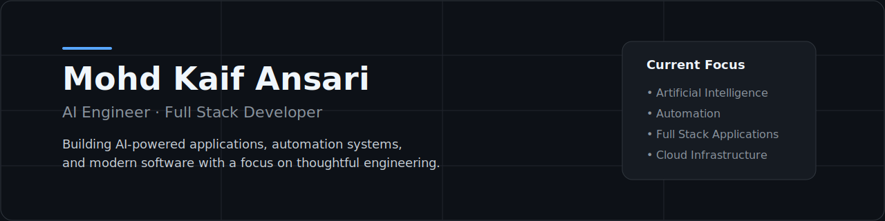

# Mohd Kaif Ansari

**AI Engineer · Full Stack Developer**

I build AI-powered applications, automation systems, and modern web products that focus on solving practical problems through thoughtful engineering.

My work primarily involves React Native, Next.js, Python, Supabase, cloud technologies, and large language models. I enjoy building products from the initial idea through production deployment, with an emphasis on clean architecture, performance, and user experience.

---

## Current Work

I'm currently focused on three long-term projects.

| Project | Description |
|---------|-------------|
| **IngRyn** | AI-powered ingredient scanner using OCR, Gemini, React Native and Supabase. |
| **AutoBrief AI** | Automated AI news platform with intelligent content generation and publishing. |
| **Portfolio** | Modern portfolio focused on clean design and showcasing engineering work. |

## Technical Expertise

### Languages

Python • TypeScript • JavaScript • Java • C++ • SQL

### Frontend

React • Next.js • React Native • Tailwind CSS

### Backend

Node.js • Express • Supabase • Firebase • REST APIs

### Artificial Intelligence

Google Gemini • OpenAI • OCR • Prompt Engineering • AI Workflows

### Cloud & Tools

AWS • Docker • Git • GitHub Actions • Linux

## Selected Projects

### IngRyn

An AI-powered mobile application that helps users understand food ingredients through optical character recognition and generative AI.

**Highlights**

- Cross-platform mobile application
- OCR-powered scanning
- AI ingredient analysis
- Secure Supabase backend
- Clean mobile-first interface

**Technology**

React Native · Expo · TypeScript · Supabase · Gemini AI

---

### AutoBrief AI

An automated publishing platform that collects news from multiple sources, processes content with AI, and generates SEO-ready articles.

**Highlights**

- Automated RSS ingestion
- AI-assisted article generation
- Google Sheets integration
- SEO optimization
- Production-ready Next.js application

**Technology**

Next.js · TypeScript · Node.js · Gemini AI

---

### Portfolio

A modern developer portfolio built around thoughtful design, performance, and accessibility.

**Technology**

Next.js · React · Tailwind CSS

## GitHub Analytics

## Open Source

I enjoy building software in the open and collaborating on projects related to artificial intelligence, developer tooling, automation, and modern web technologies.

I'm always interested in thoughtful engineering discussions, collaboration opportunities, and projects that solve practical problems.

## Contact

Portfolio  
https://techykaif.vercel.app

LinkedIn  
https://linkedin.com/in/mohd-kaif-ansari-0754522bb

GitHub  
https://github.com/techykaif

Email  
mka10171@gmail.com

---

*"Building software that solves practical problems through artificial intelligence and automation."*