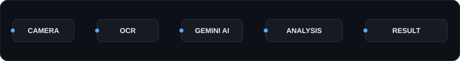
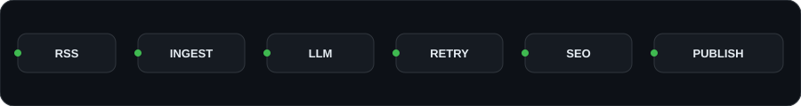
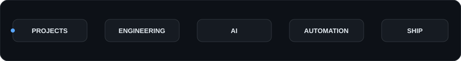
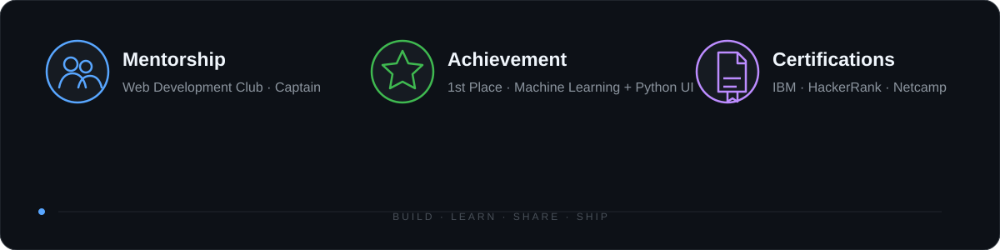

<div align="center">


<br />

<a href="https://readme-typing-svg.demolab.com/"></a>

<br />

<a href="https://techykaif.vercel.app"></a>
<a href="https://linkedin.com/in/mohd-kaif-ansari-dev"></a>
<a href="mailto:mka10171@gmail.com"></a>

</div>

---

## The short version

> **I build AI-powered products that solve real problems — from idea to production.**

I like building software where **AI is part of the product, not just a feature added at the end.** My work spans full-stack applications, mobile experiences, OCR pipelines, LLM integrations, REST APIs, automated publishing systems, and production deployment.

```text
problem → architecture → build → AI integration → automation → ship → iterate
```

<p align="center">
  
</p>

---

## What I Build

<p align="center">
  
</p>

---

# Featured Builds

## IngRyn

<p align="center">
  
</p>

### AI-powered ingredient intelligence for packaged food

> **Camera → OCR → AI analysis → understandable results**

IngRyn combines **Google ML Kit OCR** with the **Gemini API** to extract and analyze ingredient information. Supabase handles authentication, storage, and persistent scan history.

<p align="center">
  
</p>

**Built with**  `React Native` `Expo` `Supabase` `Google ML Kit` `Gemini API`

<p align="center">
  <a href="https://github.com/techykaif/ingryn"><b>→ View Repository</b></a>
</p>

---

## AutoBrief AI

<p align="center">
  
</p>

### An automated pipeline from raw news to published AI content

AutoBrief automatically collects news, processes content with LLMs, and produces SEO-ready articles through an automated publishing workflow.

The engineering focus includes **RSS ingestion, resilient AI workflows, API key rotation, retries, failover, server-side rendering, caching, SEO, and GitHub Actions automation.**

<p align="center">
  
</p>

**Built with**  `Next.js` `Node.js` `Grok API` `GitHub Actions` `RSS` `SEO`

<p align="center">
  <a href="https://github.com/techykaif/AutoBrief"><b>→ Repository</b></a>&nbsp;&nbsp;·&nbsp;&nbsp;
  <a href="https://autobrief-ai.vercel.app"><b>→ Live Application</b></a>
</p>

---

## Portfolio

<p align="center">
  
</p>

### A product-style engineering portfolio

A personal engineering portfolio designed around projects, capabilities, and a product-style presentation.

<p align="center">
  
</p>

<p align="center">
  <a href="https://techykaif.vercel.app"><b>→ Visit Portfolio</b></a>
</p>

---

# How I Think About Engineering

<p align="center">
  
</p>

```text
┌─────────────────────────────────────────────────────────┐
│                                                         │
│  01  Start with the problem, not the technology.       │
│                                                         │
│  02  Keep architecture simple until complexity         │
│      is actually justified.                             │
│                                                         │
│  03  Use AI where it creates real product value.       │
│                                                         │
│  04  Automate repetitive work instead of repeating it. │
│                                                         │
│  05  Build for production, not just the demo.           │
│                                                         │
└─────────────────────────────────────────────────────────┘
```

---

# Engineering Stack

<p align="center">
  
  
  
  
  
</p>
<p align="center"><sub><b>LANGUAGES</b> · JavaScript · Python · HTML5 · CSS3 · C</sub></p>

<p align="center">
  
  
  
  
  
</p>
<p align="center"><sub><b>FRONTEND</b> · React · Next.js · React Native · Expo · Bootstrap</sub></p>

<p align="center">
  
  
  
</p>
<p align="center"><sub><b>BACKEND & APIs</b> · Node.js · Express · Google Apps Script · REST APIs</sub></p>

<p align="center">
  
  
  
</p>
<p align="center"><sub><b>DATA</b> · Supabase · Firebase · MySQL</sub></p>

<p align="center">
  
  
  
  
</p>
<p align="center"><sub><b>AI</b> · Gemini API · Google ML Kit OCR · LLM Integration · Prompt Engineering</sub></p>

<p align="center">
  
  
  
  
  
  
  
</p>
<p align="center"><sub><b>DELIVERY & TOOLING</b> · Git · GitHub · GitHub Actions · Vercel · Netlify · VS Code · Chrome DevTools</sub></p>

---

# Beyond the Code

<p align="center">
  
</p>

- **Club Captain — Web Development Club (2023–2024)** — mentored students in JavaScript, React, Git, and frontend development.
- **1st Place — Machine Learning with Python UI Integration Project.**
- Certifications in **IBM Cybersecurity Basics**, **HackerRank Python (Basic)**, and **Netcamp Android Development**.

---

# GitHub Activity

<div align="center">


<br /><br />


<br />


</div>

---

# Currently Building

<div align="center">

`IngRyn` &nbsp;·&nbsp; `AutoBrief AI` &nbsp;·&nbsp; `AI Developer Tools`

<br /><br />

**AI × Automation × Product Engineering**

</div>

---

<div align="center">

### Let's build something useful.

<a href="https://techykaif.vercel.app"><b>Portfolio</b></a> · <a href="https://linkedin.com/in/mohd-kaif-ansari-dev"><b>LinkedIn</b></a> · <a href="mailto:mka10171@gmail.com"><b>Email</b></a>

<br /><br />

<sub>Building software that turns practical problems into working products.</sub>

</div>
